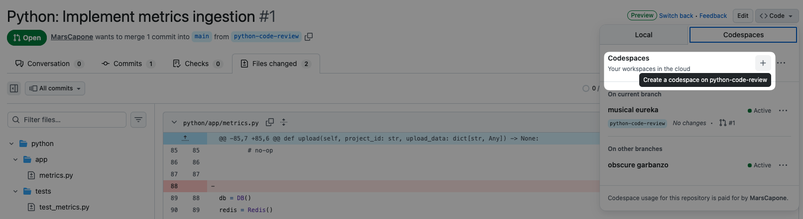

# Software Engineer Interview: Code Review

This is a template repo for candidate software engineers to use as part of the technical interview at innerworks. 

Each directory is a language that one can do the interview in. The over-arching problems are the same for all languages, but the specific problems in each might be different. 

## Instructions for interviewers

1. Open the relevant branch (see below)
2. Talk through the problem with the candidate
3. Open Codespaces to give the candidate access to a development environment
   

See (page tbc) on the wiki for the breakdown of criteria to look for in a candidate. 

### Branches

In general there should be one branch per possible language. This branch will have the commits made by another developer. 

Branches must be prefixed by the name of the directory they are modifying, if the modification is for the purpose of an interview. 